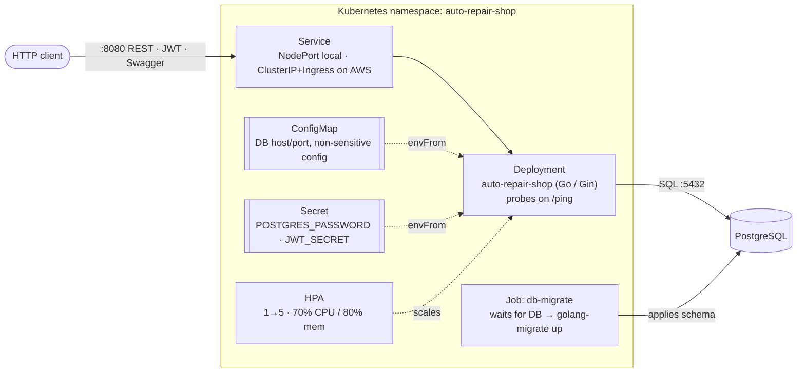
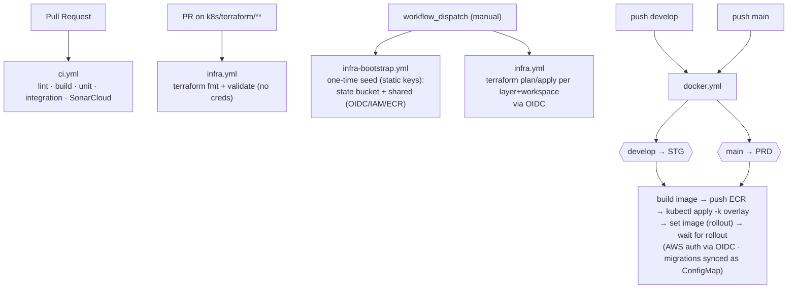

# Auto Repair Shop

Monolithic layered backend for an auto repair shop management system. Manages service orders (SO), customers, vehicles, parts/stock, and administrative operations.

**Stack:** Go · Gin · PostgreSQL · JWT · Swagger

## Domain

- **SO (Service Order)** — Service order, the central aggregate
- **Customer** — Customer identified by CPF (individual) or CNPJ (company)
- **Vehicle** — Vehicle (plate, brand, model, year), linked to a Customer
- **Service** — Billable service (name, description, unit price)
- **Part/Supply** — Part or supply with stock quantity and unit price
- **Budget** — Budget, auto-calculated from services and parts on a SO
- **Stock** — Stock/inventory of Parts

## SO Status Lifecycle

```
NEW → RECEIVED → IN_DIAGNOSIS → AWAITING_APPROVAL → IN_PROGRESS → COMPLETED → DELIVERED
  └──────────────────────────────────────────────────────────────────────────→ CANCELLED
                               AWAITING_APPROVAL → REJECTED
```

`REJECTED` is a terminal state reached when the customer rejects the budget (from `AWAITING_APPROVAL`).
`CANCELLED` is a terminal state available from cancelable statuses.

## Work Status Lifecycle (within a Service Order)

Each work item linked to a service order follows its own lifecycle:

```
AWAITING_START → IN_PROGRESS → COMPLETED
                     ↓               ↓
                 CANCELLED       CANCELLED  (can cancel from any non-terminal status)
```

| Status           | Description                            |
|------------------|----------------------------------------|
| `AWAITING_START` | Work linked to the SO, not yet started |
| `IN_PROGRESS`    | Work is being executed by the mechanic |
| `COMPLETED`      | Work was successfully finished         |
| `CANCELLED`      | Work was cancelled (terminal state)    |

Every status change is recorded as an immutable entry in `work_service_order_status_history`, preserving the full audit trail.

## Project Structure

```
cmd/
  service/          # Application entrypoint
internal/
  domain/           # Domain models (framework-free)
  infra/
    db/             # Database clients, uow, and seed
    factory/        # Dependency wiring
    handler/        # HTTP handlers
    http/           # Handlers wrapper and middlewares
    repository/     # Repository implementations
    server/         # HTTP server bootstrap
  routing/          # Route definitions
  services/         # Business logic layer
```

## Architecture

The same Go workload runs in three interchangeable ways: **(1)** locally with just
Docker Compose (no Kubernetes), **(2)** on a local **Kind** cluster that simulates
the full Kubernetes behavior end-to-end (no AWS needed), and **(3)** on **AWS
(EKS + RDS)** provisioned by Terraform. Paths (2) and (3) apply the *same*
Kustomize manifests — only the overlay changes.

### Application components



### Provisioned infrastructure (Terraform — AWS)

`k8s/terraform/` describes the AWS side, split into four independent states:

| State | Provisions | Cadence |
|---|---|---|
| `bootstrap/` | S3 bucket for remote tfstate (versioned, encrypted, native locking) | run once |
| `shared/` | ECR · GitHub OIDC provider · IAM roles (`deploy-stg/prd`, `terraform`) | run once |
| `aws/` | VPC · EKS · RDS · Secrets Manager (per Terraform workspace `stg`/`prd`) | per environment |
| `addons/` | Helm add-ons: ALB Controller · metrics-server · External Secrets (+ IRSA) | per environment |


Locally, the `overlays/local` Kustomize overlay stands in for all of this: an
in-cluster PostgreSQL replaces RDS, a NodePort replaces the ALB, and a static
Secret replaces Secrets Manager — so Kind reproduces the AWS topology with zero
cloud dependency.

### Deploy flow (GitHub Actions)



## Prerequisites

- [Go 1.26+](https://go.dev/dl/)
- [Docker & Docker Compose](https://docs.docker.com/get-docker/)
- Make

## Contributing

To contribute to the project you should install pre-commit:

```bash
# 1. Make sure you have Python installed
python3 --version # or (on Windows) python --version

# 1.1 If you do not have Python installed:
brew install python # or (on Windows) download from https://www.python.org/downloads/

# 2. Install pre-commit using pip
pip install pre-commit

# 3. Install the pre-commit hooks for this repository
pre-commit install
```

## Getting Started

There are three ways to run this project — pick the one that fits what you want to do:

| # | Path | Needs | Use when | Jump to |
|---|---|---|---|---|
| 1 | **Local (Docker Compose)** | Docker only, **no Kubernetes/infra** | Run the app + DB fast, for development | [Setup with Docker](#2-setup-with-docker) |
| 2 | **Kubernetes on Kind** | Docker only (toolbox) | Exercise the *full* k8s workload locally (Deployment, HPA, migrate Job, Service) — a faithful stand-in for AWS | [Full environment on Kind](#bring-up-the-full-environment-locally-docker-only) |
| 3 | **AWS with Terraform** | GitHub repo + AWS account | Provision the cloud infra (VPC/EKS/RDS) and deploy for real | [AWS (stg / prd)](#aws-stg--prd--driven-from-github) |

> Paths 2 and 3 deploy the **same** Kustomize manifests — Kind locally reproduces the
> AWS topology, so you can validate the entire Kubernetes behavior without any cloud cost.

### 1) Environment Variables

Create a local `.env` file before running the project:

```bash
cp .env.example .env
```

### 2) Setup with Docker

```bash
# Start all services (app, migrations, and database)
make docker-up
```

API URL: `http://localhost:8080`

### 3) Local Development (app outside Docker)

Use this flow when you want to run only the database in Docker and the app directly with Go:

```bash
# Start only PostgreSQL
# (in a separate terminal, from repository root)
docker-compose up -d db

# Install migration tool (first time only)
make migrate-install

# Run all pending migrations
make migrate-up

# Start the application locally
make run
```

### Useful Commands

```bash
# Run tests
make test

# Generate coverage report
make coverage

# Stop Docker containers
make docker-down
```

The server starts on port `${PORT:-8080}` (default: 8080).

## API Collection (Swagger UI)

Once the app is running locally (`make docker-up` or `make k8s-up`), the interactive
API collection is served by the built-in Swagger UI — use it to browse and execute
every endpoint directly against the running server:

**➡️ http://localhost:8080/swagger/index.html**

The UI loads the OpenAPI specification from `/swagger.yaml` (source: `docs/swagger.yaml`)
and lets you fire requests without any external tool (Postman/Insomnia not required).

## Database Migrations

Migrations are managed using `golang-migrate` and stored in the `/migrations` directory. Each migration consists of `.up.sql` (apply) and `.down.sql` (rollback) files.

### Migration Commands

```bash
# Install golang-migrate CLI (first time only)
make migrate-install

# Apply all pending migrations
make migrate-up

# Rollback the last applied migration
make migrate-down

# Check current migration version
make migrate-status
```

When adding schema changes, create migration files following the naming convention:
```
NNNNNN_description.up.sql
NNNNNN_description.down.sql
```

Where `NNNNNN` is a sequential 6-digit number (e.g., `000002_add_customer_status.up.sql`).

## Infrastructure (`k8s/`)

Kubernetes and Terraform configuration lives in `k8s/` (config files only — the
tooling is driven from this root `Makefile` via `make k8s-*`).

- **`k8s/terraform/`** — infrastructure, split into four states:
  - `bootstrap/` — the S3 bucket for remote state (run once).
  - `shared/` — ECR + GitHub OIDC provider + deploy/terraform IAM roles (run once).
  - `aws/` — VPC, EKS, RDS per environment, selected by Terraform **workspace**
    (`stg` / `prd`). Remote state (S3 + native locking).
  - `addons/` — per-env cluster add-ons via Helm: AWS Load Balancer Controller,
    metrics-server, External Secrets Operator (+ IRSA).
- **`k8s/manifests/`** — the app's Kubernetes workload only (Deployment, Service,
  ConfigMap, Secret, HPA, migration Job) as Kustomize overlays.
- **`k8s/kind/`** — local Kind cluster config.
- **`k8s/toolbox/`** — Docker-only path (toolbox image + runner).

```
k8s/
├── terraform/
│   ├── bootstrap/   # S3 state bucket (run once)
│   ├── shared/      # ECR + GitHub OIDC + IAM roles (run once)
│   ├── aws/         # VPC, EKS, RDS per env (workspaces: stg | prd)
│   └── addons/      # ALB controller + metrics-server + External Secrets (per env)
├── manifests/
│   ├── base/        # Deployment, Service, ConfigMap, HPA, migrate Job
│   └── overlays/
│       ├── local/   # + static Secret + in-cluster Postgres, NodePort, dev values
│       ├── stg/     # RDS host, ECR image, ALB Ingress, External Secrets, HPA 2-6
│       └── prd/     # same as stg with prod values (HPA 3-10)
├── kind/            # local Kind cluster config
└── toolbox/         # Docker-only runner (kind/kubectl/terraform in a container)
```

### Bring up the full environment locally (Docker-only)

**The only requirement on your machine is Docker.** `kind`, `kubectl`,
`terraform` and `aws` run inside a toolbox container that drives the host Docker
daemon (Docker-outside-of-Docker) — nothing else is installed. Three commands:

```bash
make k8s-up      # Kind cluster -> build+load image -> deploy -> smoke -> metrics-server (HPA)
make k8s-down    # tear everything down (delete the Kind cluster)
make k8s-shell   # shell inside the toolbox for anything else
```

After `make k8s-up` the app is reachable from the host:

```bash
curl http://localhost:8080/ping   # -> {"message":"pong"}
```

Anything else is plain `kubectl`/`kind`/`terraform`/`aws` from the toolbox shell:

```bash
make k8s-shell
# then, inside the container:
kubectl -n auto-repair-shop get pods,svc,job,hpa
kubectl -n auto-repair-shop logs -l app=auto-repair-shop -f
```

How it works: with the Docker socket mounted, Kind and the app image land on the
host daemon. The toolbox joins the `kind` network and reaches the cluster by the
control-plane container name (works on macOS, where `--network host` is
unreliable), while the `30080 -> localhost:8080` mapping lets you hit the app
from the host. Locally Postgres runs in-cluster (stand-in for RDS), so there is
no AWS dependency at all.

### AWS (stg / prd) — driven from GitHub

No AWS tooling is needed on your machine; all infra is applied by GitHub Actions.

The state bucket name is derived automatically from your AWS account id
(`auto-repair-shop-tfstate-<account_id>`), so it never collides globally and
adapts to ephemeral lab accounts — you never pick a name by hand.

**One-time bootstrap** (the only step that uses static AWS keys):
1. Set `github_repo` in `k8s/terraform/shared/variables.tf` to your `owner/repo`.
2. Add repo secrets `AWS_ACCESS_KEY_ID` / `AWS_SECRET_ACCESS_KEY` (an admin user).
3. Run the **Infra bootstrap (one-time)** workflow → creates the state bucket,
   the GitHub OIDC provider, the IAM roles and ECR, and prints the outputs.
4. Remove the two AWS key secrets — everything after this uses OIDC.

**GitHub config** (Settings → Environments):
- `infra` → variable `AWS_TERRAFORM_ROLE_ARN` = shared output `terraform_role_arn`
  (add required reviewers to gate infra applies).
- `STG` and `PRD` → variables:

| Variable | Source |
|---|---|
| `AWS_REGION` | `us-east-1` |
| `AWS_DEPLOY_ROLE_ARN` | shared output `deploy_role_arns` (STG / PRD) |
| `EKS_CLUSTER_NAME` | aws output `cluster_name` (per workspace) |
| `RDS_HOST` | aws output `db_host` (per workspace) |

**Provision the clusters** — run the **Infra (Terraform)** workflow with
`action=apply` for each: `aws` stg, `aws` prd, `addons` stg, `addons` prd. Copy
the printed `cluster_name` / `db_host` into the STG/PRD variables above.

**Deploy the app** — push to `develop` (→ STG) or `main` (→ PRD): the Docker
workflow builds, pushes to ECR and applies the matching overlay.

PRs touching `k8s/terraform/**` get an automatic `fmt` + `validate` (no creds).
Prefer running infra by hand? `make k8s-shell` has terraform/kubectl/aws.

#### Restricted accounts (AWS Academy Learner Lab)

Learner Lab accounts forbid creating IAM roles / OIDC providers, so the stack
runs in a degraded mode. **The only thing you configure is the three AWS
credential secrets** — everything else is detected at runtime:

- `AWS_AUTH_MODE` — `static` when `AWS_ACCESS_KEY_ID` is set, else `oidc`.
- `MANAGE_IAM` / `EXECUTION_ROLE_ARN` — from `aws sts get-caller-identity`: a
  `voclabs`/`LabRole` caller ⇒ `manage_iam=false` and
  `execution_role_arn=arn:aws:iam::<account_id>:role/LabRole`.

Each of these is still honoured as an explicit override if you set the matching
repo variable (`AWS_AUTH_MODE`, `MANAGE_IAM`, `EXECUTION_ROLE_ARN`).

Add secrets `AWS_ACCESS_KEY_ID` / `AWS_SECRET_ACCESS_KEY` / `AWS_SESSION_TOKEN`
(the lab's temporary credentials — refresh them each session, they expire). In
lab mode the stack reuses `LabRole` for the EKS cluster and nodes and creates
**no** OIDC provider, deploy/terraform roles or IRSA — so the ALB Controller and
External Secrets are skipped. Expose the app with `kubectl port-forward` (see
below) instead of an ALB Ingress, and provide
the app secret as a plain Kubernetes `Secret`. Caveat: lab accounts are
ephemeral — resources and the account id may reset between sessions.

### Accessing the app on AWS

The app is exposed by an **ALB**, created automatically by the AWS Load Balancer
Controller from the `Ingress` (the controller is installed by the `addons`
state). Terraform provisions the VPC routing (route tables, IGW, NAT) and installs
the controller; the ALB itself is created at deploy time from the Ingress.

```bash
make k8s-shell        # or use your own kubectl against the cluster
aws eks update-kubeconfig --region us-east-1 --name auto-repair-shop-stg-eks
kubectl -n auto-repair-shop get ingress auto-repair-shop
# ADDRESS = k8s-autorepa-....elb.amazonaws.com  <- the ALB DNS name
```

The Ingress has a `host:` rule (`auto-repair-shop-stg.example.com`), so the ALB
only routes requests carrying that Host header. To actually reach it either:
- point a DNS record (Route 53) for that host at the ALB DNS name, then browse
  `http://auto-repair-shop-stg.example.com/ping`; or
- for a quick test, send the header: `curl -H 'Host: auto-repair-shop-stg.example.com' http://<alb-dns>/ping`.

> **Notes:** the static Secret in `k8s/manifests/overlays/local/secret.yaml` holds
> dev-only values and is used only by Kind. On AWS the `stg`/`prd` overlays get
> `POSTGRES_PASSWORD` / `JWT_SECRET` from Secrets Manager via the External Secrets
> Operator (Terraform generates the values and mirrors them into the secret) — real
> values are never committed. Terraform state is stored remotely in the S3 bucket
> created by the `bootstrap` stage, with **native S3 locking** (no DynamoDB). The
> `.github/workflows/docker.yml` `publish`/`deploy` jobs are fully implemented
> (build → push to ECR → `kubectl apply -k` → image rollout).

## Environment Variables

| Variable                  | Description                                         |
|---------------------------|-----------------------------------------------------|
| `SONARQUBE_USERNAME`      | SonarQube username                                  |
| `SONARQUBE_PASSWORD`      | SonarQube password                                  |
| `SONARQUBE_PROJECT_TOKEN` | SonarQube project token                             |
| `POSTGRES_USER`           | PostgreSQL username                                 |
| `POSTGRES_PASSWORD`       | PostgreSQL password                                 |
| `POSTGRES_DB`             | PostgreSQL database name                            |
| `POSTGRES_HOST`           | PostgreSQL host (`db` in Docker, `localhost` local) |
| `POSTGRES_PORT`           | PostgreSQL port (default: 5432)                     |
| `JWT_SECRET`              | Secret key for JWT signing                          |
| `JWT_EXPIRES_IN`          | Token expiration duration (e.g. `24h`)              |
| `BCRYPT_COST`             | bcrypt hashing cost factor (min 12 in production)   |

## API Endpoints

### Public

| Method | Path                           | Description          |
|--------|--------------------------------|----------------------|
| POST   | `/v1/auth/login`               | Get JWT              |
| GET    | `/v1/service-order/:id/status` | Customer SO tracking |

### Users

| Method | Path                  | Roles |
|--------|-----------------------|-------|
| POST   | `/v1/auth/register`   | ADMIN |
| PATCH  | `/v1/users/:id/role`  | ADMIN |

### Customers

| Method | Path                | Roles            |
|--------|---------------------|------------------|
| POST   | `/v1/customers`     | ADMIN, ATTENDANT |
| GET    | `/v1/customers`     | ADMIN, ATTENDANT |
| GET    | `/v1/customers/:id` | ADMIN, ATTENDANT |
| PUT    | `/v1/customers/:id` | ADMIN, ATTENDANT |
| DELETE | `/v1/customers/:id` | ADMIN, ATTENDANT |

### Works

| Method | Path            | Roles                      |
|--------|-----------------|----------------------------|
| GET    | `/v1/works`     | ADMIN, ATTENDANT, MECHANIC |
| POST   | `/v1/works`     | ADMIN, ATTENDANT           |
| PUT    | `/v1/works/:id` | ADMIN, ATTENDANT           |
| DELETE | `/v1/works/:id` | ADMIN, ATTENDANT           |

### Vehicles

| Method | Path                         | Roles                      |
|--------|------------------------------|----------------------------|
| GET    | `/v1/vehicles`               | ADMIN, ATTENDANT, MECHANIC |
| GET    | `/v1/vehicles/:customerId`   | ADMIN, ATTENDANT, MECHANIC |
| POST   | `/v1/vehicles`               | ADMIN, ATTENDANT           |
| PUT    | `/v1/vehicles/:id`           | ADMIN, ATTENDANT           |
| DELETE | `/v1/vehicles/:id`           | ADMIN, ATTENDANT           |

### Supplies

| Method | Path               | Roles                      |
|--------|--------------------|----------------------------|
| GET    | `/v1/supplies`     | ADMIN, ATTENDANT, MECHANIC |
| POST   | `/v1/supplies`     | ADMIN, ATTENDANT, MECHANIC |
| PUT    | `/v1/supplies/:id` | ADMIN, ATTENDANT, MECHANIC |
| DELETE | `/v1/supplies/:id` | ADMIN, ATTENDANT, MECHANIC |

### Service Orders (SO)

| Method | Path                                       | Roles                      |
|--------|--------------------------------------------|----------------------------|
| POST   | `/v1/service-order`                        | ADMIN, ATTENDANT           |
| GET    | `/v1/service-order`                        | ADMIN, ATTENDANT, MECHANIC |
| GET    | `/v1/service-order/:id`                    | ADMIN, ATTENDANT, MECHANIC |
| PUT    | `/v1/service-order/:id/received`           | ADMIN, ATTENDANT           |
| PUT    | `/v1/service-order/:id/start-diagnosis`    | ADMIN, MECHANIC            |
| PUT    | `/v1/service-order/:id/send`               | ADMIN, MECHANIC            |
| PUT    | `/v1/service-order/:id/accept`             | CUSTOMER (own SO only)     |
| PUT    | `/v1/service-order/:id/reject`             | CUSTOMER (own SO only)     |
| PUT    | `/v1/service-order/:id/finish`             | ADMIN, MECHANIC            |
| PUT    | `/v1/service-order/:id/deliver`            | ADMIN, ATTENDANT           |
| PUT    | `/v1/service-order/:id/cancel`             | ADMIN, ATTENDANT, MECHANIC |
| GET    | `/v1/service-order/:id/history`            | ADMIN, ATTENDANT, MECHANIC |
| GET    | `/v1/service-order/:id/works`              | ADMIN, ATTENDANT, MECHANIC |
| POST   | `/v1/service-order/:id/works`              | ADMIN, ATTENDANT           |
| DELETE | `/v1/service-order/:id/works/:serviceId`   | ADMIN, ATTENDANT           |
| GET    | `/v1/service-order/:id/supplies`           | ADMIN, ATTENDANT, MECHANIC |
| POST   | `/v1/service-order/:id/supplies`           | ADMIN, MECHANIC            |
| DELETE | `/v1/service-order/:id/supplies/:supplyId` | ADMIN, MECHANIC            |

### Work Status Transitions (within a SO)

| Method | Path                                        | Roles            |
|--------|---------------------------------------------|------------------|
| PUT    | `/v1/service-order/:id/work/:workId/next`   | ADMIN, MECHANIC  |
| PUT    | `/v1/service-order/:id/work/:workId/cancel` | ADMIN, MECHANIC  |

### Admin

| Method | Path                                 | Roles            |
|--------|--------------------------------------|------------------|
| POST   | `/v1/auth/register`                  | ADMIN            |
| PATCH  | `/v1/users/:id/role`                 | ADMIN            |

### Reports

| Method | Path                                 | Roles            |
|--------|--------------------------------------|------------------|
| GET    | `/v1/reports/average-execution-time` | ADMIN, ATTENDANT |

## RBAC Roles

| Role       | Description                                                                  |
|------------|------------------------------------------------------------------------------|
| ADMIN      | Full access, including user management and role updates                      |
| ATTENDANT  | Customers, vehicles, works, service orders, supplies, and execution reports  |
| MECHANIC   | Service order execution flow, supplies, and work status transitions          |
| CUSTOMER   | Own service order status tracking and budget approve/reject only             |

## Password Encryption

User passwords are protected using bcrypt (`golang.org/x/crypto/bcrypt`).

Key details:
- **Type:** one-way hash (not reversible). The output includes an internal salt and metadata.
- **Implementation:** `bcrypt.GenerateFromPassword` is used when creating or updating passwords; `bcrypt.CompareHashAndPassword` is used for validation.
- **Cost factor:** controlled by the `BCRYPT_COST` environment variable (see Environment Variables). A minimum cost of 12 is recommended in production — increase it according to your infrastructure capacity.

Notes:
- For automatically created customers, the default password (CPF/CNPJ) is immediately hashed before being persisted.
- bcrypt applies a salt securely by default; there is no need to manage salts manually.

## License

This project is part of the FIAP 15SOAT postgraduate program.

## Members

- Caetano Agostinho de Freitas - RM371006
- Emanuel Jesus Santos - RM371184
- Diogo Estevão Ferreira - RM371059
- Giusier Ferreira Soares - RM371064
- Guilherme Ferreira Santos - RM374002
